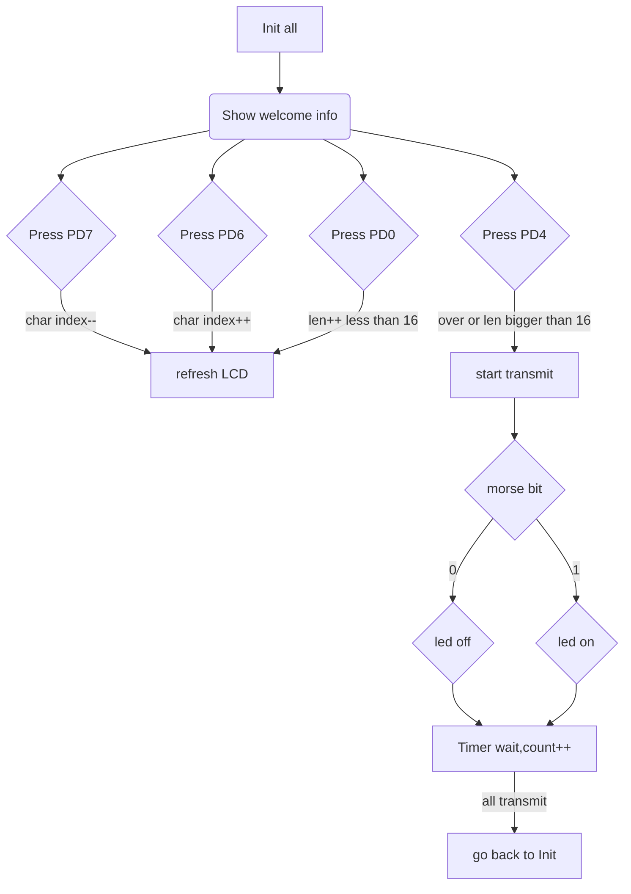

# ECE 375 Final Report

## Implement

1. use timer as counter for the pause or one unit time wait
2. make the Morse code to bits
3. deal  with the input key and show it to LCD

The main process is a loop,but the transmit also a loop,only the wait use timer interrupt.

- the key input has debouncing,8ms
- the input could loop show
- Ignore all button inputs when transmit and anti-interference
- LCD show accuratly

## Main process

1. Initialize led IO and key io
2. Initialize the timer, read the value from the fixed address, and then convert it into the corresponding unit time
3. Initialize LCD
4. Polling for input, display to LCD according to various input conditions
5. At the end of input, convert the corresponding Morse code bits according to the input content, and output LED according to the situation of 0 and 1. Wait for the interrupt to complete and return to the initialization place





## Transmit Process

```
Current bit index = first bit

ROL gets the bit

BRCS decides to jump based on this bit being 1

If it jumps, the LED lights up and waits for the end

If it doesn't jump, the LED is off and the wait is over

After the end, bits + 1. If bits = = 8, read the next byte and continue the loop,

If the number of bits = = 16, the loop ends, waits for 3 time cycles, and then returns to the original cycle
```


## Timer

Timer can be set to trigger for 1s at a time. If a fixed value is read, all Pb will be pulled up / down.

Timer count 1 is a 16 bit counter. In CTC mode, the counter is cleared after price match.

The clock source is 16mhz, which can be divided into 1, 8, 64, and the maximum frequency is 1024.

After 1024, the frequency is about 15625HZ. The maximum count of 65535 is 4 seconds, which is more than enough.

When the comparison count value is 15625, the timing is 1 second.

If the timing is 100ms, it can be set to 1562. In this way, the timer function can be completed.

We can also use 256 frequency division to change to 62500hz, and then set 62500 to 1 second, 12500 to 200ms

The corresponding CS is bits(100),i choose 256 prescale.

##### Timer Config

```
TCCR1A is all zero for CTC mode
TCCR1B CS is bits(100)
set TCNT1H,TCNT1L to 62500 or 12500 
TIMSK OCIE1A could enable or disable interrupt
```


## Morse to bits

Morse has 2 code,dot and dash. Make dot as the unit,dash is 3 unit.  Assum 1 uint as bit(1),the pasue of letter as bit(0), Encode the Morse code in bits,we could get the table.

| Char | Morse | bits          | hex       |
| ---- | ----- | ------------- | --------- |
| A    | .-    | 10111         | 0x00,0x17 |
| B    | -...  | 111010101     | 0x01,0xD5 |
| C    | -.-.  | 11101011101   | 0x07,0x5D |
| D    | -..   | 1110101       | 0x00,0x75 |
| E    | .     | 1             | 0x00,0x01 |
| F    | ..-.  | 101011101     | 0x01,0x5D |
| G    | --.   | 111011101     | 0x01,0xDD |
| H    | ....  | 1010101       | 0x00,0x55 |
| I    | ..    | 101           | 0x00,0x05 |
| J    | .---  | 1011101110111 | 0x17,0x77 |
| K    | -.-   | 111010111     | 0x01,0xD7 |
| L    | .-..  | 101110101     | 0x01,0x75 |
| M    | --    | 1110111       | 0x00,0x77 |
| N    | -.    | 11101         | 0x00,0x1D |
| O    | ---   | 11101110111   | 0x07,0x77 |
| P    | .--.  | 10111011101   | 0x05,0xDD |
| Q    | --.-  | 1110111010111 | 0x1D,0xD7 |
| R    | .-.   | 1011101       | 0x00,0x5D |
| S    | ...   | 10101         | 0x00,0x15 |
| T    | -     | 111           | 0x00,0x07 |
| U    | ..-   | 1010111       | 0x00,0x57 |
| V    | ...-  | 101010111     | 0x01,0x57 |
| W    | .--   | 101110111     | 0x01,0x77 |
| X    | -..-  | 11101010111   | 0x07,0x57 |
| Y    | -.--  | 1110101110111 | 0x1D,0x77 |
| Z    | --..  | 11101110101   | 0x07,0x75 |

In this way, the maximum number of bytes obtained by re encoding 26 letters is no more than 2 bytes. There is a stable rule after encoding, that is, the beginning and end of a Morse code must be 1. Then, the actual output code can be obtained by character comparison (starting from the first bit not 0 and ending with the last bit)


## Insight

When i use the BRXX,it's so annoy that everyone has diferent situation.Only using just one judege methord make the code ugly.

All the information about Timer ,need to check the Atmega128 datasheed,there is so many words i dont konw thire means before i tried.

I think i could do better in these aspect

- more comment
- more funcs
- the var more readable

# ref

ref code

>https://github.com/search?o=desc&q=ece375&s=updated&type=Repositories
>
>https://github.com/garcaaro/ECE375/blob/main/Aaron_Garcia_Lab4_sourcecode.asm
>
>https://github.com/garcaaro/ECE375/blob/main/Aaron_Garcia_Lab6_sourcecode.asm
>
>https://github.com/garcaaro/ECE375/blob/main/Aaron_Garica_lab7_sourcecode.asm


